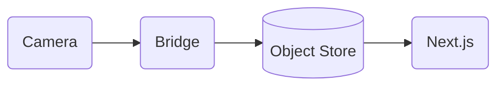

# Architecture Overview

```mermaid
flowchart LR
    camera(Camera)
    bridge(Bridge)
    objectstore[(Object Store)]
    nextjs(Next.js)

    camera --> bridge --> objectstore --> nextjs
```

This diagram shows the data flow from the camera through the bridge into an object store and finally into the Next.js application.
