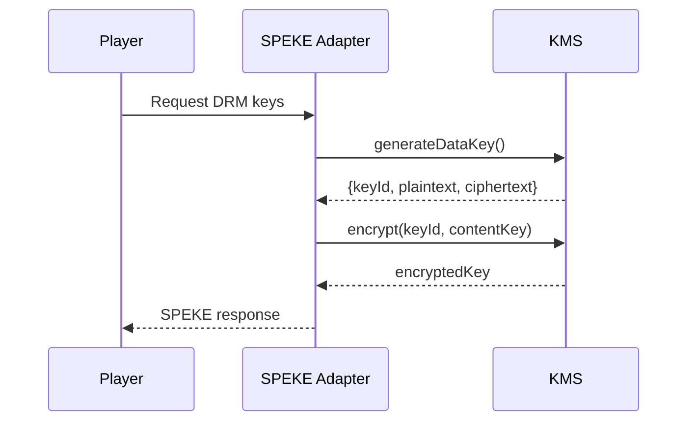

# KMS Interface Design

The application uses a pluggable key management service (KMS) to keep
cryptographic operations isolated from business logic. The interface
exposes a minimal set of primitives required by the DRM workflow.

## Architecture



## Code Stub

```ts
export interface KeyManagementService {
  generateDataKey(keySpec: string): Promise<GeneratedKey>;
  encrypt(keyId: string, plaintext: Buffer): Promise<Buffer>;
  decrypt(keyId: string, ciphertext: Buffer): Promise<Buffer>;
}
```

Implementations such as `PlaceholderKms` should be replaced with
production-ready providers that enforce access control, auditing and
secure key storage.
